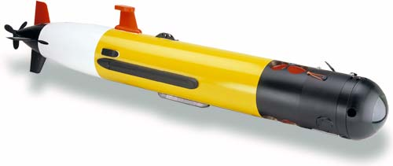

# Matlab/Simulink implementation of Path Following for a REMUS 100

There is two sections of this implementation:

A) A simulink file that contains a REMUS 100 model, LOS law implementation and robust PID controller

B) A Matlab script that implements in script version of the simulink file.

This code is based in the work of [Fossen and Breivik](http://www.fossen.biz/home/papers/FossenBreivikSkjetneMCMC03.pdf)
and the work of [Xiang and et al.](https://www.sciencedirect.com/science/article/pii/S0305054816302374)

The model of the remus 100 employed on this study is from [Prestero](https://core.ac.uk/download/pdf/4429735.pdf).

  

[[https://github.com/ArizaWilmerUTAS/Path-Following/sample.png|alt=sample]]

## Getting Started

To run the simulink model please use MATLAB 2018b or superior.

To run the Matlab Script add the content of the folder to the Matlab path and run the file SimulatorFileRemusPID.m.

## Referencing

If you wish to reference this code please cite:

W. Ariza Ramirez, Gaussian Processes applied to system identification, navigation and control of underwater vehicles, PhD Thesis, Australian Maritime College 2019

https://eprints.utas.edu.au/32574/

## Author

Wilmer Ariza Ramirez

Australian Maritime College, 
University of Tasmania, Newnham TAS 7248, Australia

Wilmer.ArizaRamirez@utas.edu.au 
